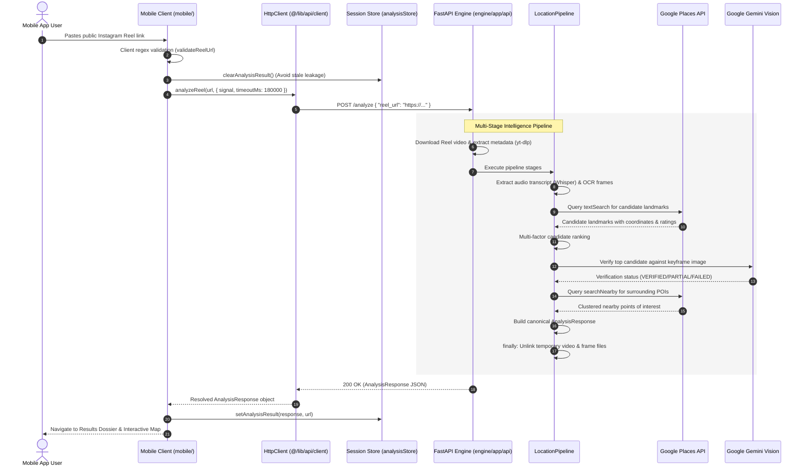

# Travel AI — API & Integration Communication Guide

- **Document Role:** Authoritative API Specification, Integration Contracts, and Network Communication Guide
- **Repository:** Travel AI (`travel-ai`)
- **Primary Surfaces:** React Native Mobile Client (`mobile/`) & FastAPI Intelligence Engine (`engine/`)
- **Status:** Canonical Operating Standard

---

## 1. Purpose & Scope

This guide defines the complete HTTP REST API architecture and external integration mechanisms for **Travel AI**. It details how the **React Native/Expo mobile client**, the standalone **Python FastAPI intelligence engine**, and external third-party services exchange data:

```text
React Native Mobile Client (mobile/)
        │  Typed HTTP REST (POST /analyze, GET /health, GET /places/photo)
        ▼
FastAPI Intelligence Engine (engine/)
        │  Pipeline Orchestration
        ▼
External Services & APIs
  ├── Instagram Media Extraction (yt-dlp via ProviderManager)
  ├── Audio Speech-to-Text (OpenAI Whisper)
  ├── On-Screen Keyframe OCR (EasyOCR / OpenCV)
  ├── Geographic Grounding (Google Places API — Search, Details, Nearby)
  └── Multimodal Verification (Google Gemini 2.5 Flash Vision)
```

The mobile client is the **primary product consumer** of this API. The legacy Next.js web application (`app/api/analyze/route.ts`) acts as a secondary server-side proxy to the same FastAPI backend.

---

## 2. API Architecture & Communication Flow

### 2.1 High-Level Request Pipeline



---

## 3. Environment & Base URL Configuration

The API connection URL is never hardcoded inside visual components. It is resolved centrally in `mobile/constants/config.ts`:

| Environment | Client Target | Engine URL Resolution | Behavior |
| :--- | :--- | :--- | :--- |
| **Development** (`__DEV__ = true`) | iOS Simulator / Web | `http://localhost:8000` | Local machine loopback |
| **Development** (`__DEV__ = true`) | Android Emulator | `http://10.0.2.2:8000` | Android host loopback alias |
| **Development** (`__DEV__ = true`) | Physical Device | `http://<YOUR_LAN_IP>:8000` | Local Wi-Fi network routing |
| **Production** (`__DEV__ = false`) | App Store / Play Store | `EXPO_PUBLIC_API_URL` (HTTPS) | **Required.** Loopback fallbacks are disabled. |

### Environment Variables Matrix

```text
mobile/.env (Client-side)
└── EXPO_PUBLIC_API_URL=https://api.travelai.example.com    [Public to JS bundle]

engine/.env (Server-side ONLY)
├── GOOGLE_PLACES_API_KEY=AIzaSy...                        [CRITICAL: Never send to mobile]
├── GEMINI_API_KEY=AIzaSy...                               [CRITICAL: Never send to mobile]
├── GEMINI_MODEL=gemini-2.5-flash                          [Model designation]
├── OPENWEATHER_API_KEY=...                                [Optional weather enrichment]
└── CORS_ORIGINS=https://app.travelai.example.com          [Allowed web origins]
```

> [!IMPORTANT]
> Third-party credentials (`GOOGLE_PLACES_API_KEY`, `GEMINI_API_KEY`) remain strictly server-side. The mobile application owns **zero** third-party API keys.

---

## 4. Endpoints Specification

### 4.1 `POST /analyze`

Analyzes a public Instagram Reel URL and returns structured geographic intelligence, verification status, surrounding highlights, and practical travel context.

* **Route Handler:** `engine/app/api/analyze.py`
* **HTTP Method:** `POST`
* **Content-Type:** `application/json`
* **Client Service:** `travelAiApi.analyzeReel(url)` in `mobile/lib/api/travel-ai.ts`

#### Request Payload (`AnalyzeRequest`)

| Field | Type | Required | Description |
| :--- | :--- | :--- | :--- |
| `reel_url` | `string` | Optional* | The target public Instagram Reel link. |
| `url` | `string` | Optional* | Backward-compatible alias for `reel_url`. |

*\*At least one of `reel_url` or `url` must be provided and must match the Reel regex.*

```json
{
  "reel_url": "https://www.instagram.com/reel/C8xyzExample1/",
  "url": "https://www.instagram.com/reel/C8xyzExample1/"
}
```

#### Request Validation Rules
* Validated server-side via Pydantic `@model_validator`:
  `^https?://(?:www\.)?instagram\.com/(?:reel|reels)/([A-Za-z0-9_-]+)`
* Non-Reel URLs (photo posts `/p/`, expiring stories `/stories/`, user profiles) are rejected with HTTP 400 Bad Request before downloading media.

---

#### Success Response (`AnalysisResponse` — Resolved Destination)
**HTTP Status:** `200 OK`

```json
{
  "success": true,
  "best_guess": {
    "place_id": "ChIJ_3jP9EabmUcR5kCgX_X1AAA",
    "name": "Seebensee",
    "formatted_address": "Ehrwald 6632, Tyrol, Austria",
    "country": "Austria",
    "city": "Ehrwald",
    "region": "Tyrol",
    "latitude": 47.368912,
    "longitude": 10.923456,
    "rating": 4.9,
    "user_ratings_total": 850,
    "types": [
      "natural_feature",
      "tourist_attraction"
    ],
    "photos": [
      {
        "url": "/places/photo?name=places%2FChIJ_3jP9EabmUcR5kCgX_X1AAA%2Fphotos%2FAUacSh...",
        "width": 1920,
        "height": 1080,
        "author": "Alpine Visuals"
      }
    ],
    "maps_url": "https://www.google.com/maps/search/?api=1&query=47.368912,10.923456&query_place_id=ChIJ_3jP9EabmUcR5kCgX_X1AAA",
    "confidence": 94,
    "confidence_level": "VERY_HIGH",
    "verification_status": "VERIFIED",
    "gemini_confidence": 0.95,
    "gemini_reason": "Visual keyframe confirms alpine turquoise lake framed by distinctive limestone peaks matching Seebensee.",
    "why": "Identified through on-screen German signage and verified via Gemini multimodal vision against alpine keyframes."
  },
  "travel_intelligence": {
    "category": "Nature",
    "category_emoji": "🏔️",
    "best_season": "Summer & Autumn",
    "peak_months": [
      "July",
      "August"
    ],
    "shoulder_months": [
      "June",
      "September"
    ],
    "avoid_months": [
      "November",
      "December",
      "January"
    ],
    "budget_level": "$$",
    "estimated_daily_budget": "$120 - $180",
    "currency": "EUR",
    "recommended_trip_days": "1-2 days",
    "travel_tips": [
      "Take the Ehrwalder Almbahn cable car to shorten the initial ascent.",
      "Start before 08:00 to catch still water reflections."
    ],
    "activities": [
      "Alpine Hiking",
      "Photography",
      "Mountain Biking"
    ],
    "travel_summary": "A high-altitude alpine lake nestled beneath the Mieming Range and Zugspitze massif."
  },
  "nearby_places": [
    {
      "place_id": "ChIJ_nearby_01",
      "name": "Coburger Hütte",
      "formatted_address": "Ehrwald, Austria",
      "latitude": 47.3645,
      "longitude": 10.9250,
      "rating": 4.8,
      "user_ratings_total": 520,
      "types": [
        "lodging",
        "restaurant"
      ],
      "distance_km": 1.2,
      "maps_url": "https://www.google.com/maps/search/?api=1&query=47.3645,10.9250",
      "category": "Dining"
    }
  ],
  "gemini": {
    "used": true,
    "status": "VERIFIED",
    "confidence": 0.95,
    "reason": "Confirmed match between video keyframe and reference imagery.",
    "vision": {
      "landmark": "Seebensee",
      "confidence": 0.95
    },
    "scene": {
      "type": "alpine_lake",
      "setting": "mountain"
    }
  },
  "stage": "completed",
  "performance": {
    "total_seconds": 18.42,
    "stages": {
      "provider": 3.82,
      "location_extraction": 4.15,
      "candidate_resolution": 2.10,
      "verification": 3.45,
      "nearby_places": 2.40,
      "travel_intelligence": 1.20,
      "response_building": 0.05
    }
  },
  "error": null
}
```

---

#### Unresolved Response (`AnalysisResponse` — No Supported Destination)
**HTTP Status:** `200 OK`  
When the pipeline executes successfully but cannot verify a candidate destination with sufficient confidence, it returns a truthful, structured unresolved object rather than a 500 error:

```json
{
  "success": false,
  "best_guess": null,
  "travel_intelligence": {},
  "nearby_places": [],
  "gemini": {
    "used": false,
    "status": "FAILED",
    "confidence": 0.0,
    "reason": "No destination candidates found from the Reel."
  },
  "stage": "failed",
  "performance": {
    "total_seconds": 12.15,
    "stages": {
      "provider": 3.50,
      "location_extraction": 8.65,
      "candidate_resolution": 0.0,
      "verification": 0.0,
      "nearby_places": 0.0,
      "travel_intelligence": 0.0,
      "response_building": 0.01
    }
  },
  "error": "No destination candidates found from the Reel."
}
```

---

### 4.2 `GET /places/photo`

Proxies Google Places photo media server-side so that `GOOGLE_PLACES_API_KEY` is never exposed in client bundles or network logs.

* **Route Handler:** `engine/app/api/analyze.py`
* **HTTP Method:** `GET`
* **Client Service:** Resolved automatically via `analysisStore.resolvePhotoUrl(photoUrl)`

#### Query Parameters

| Parameter | Type | Required | Description |
| :--- | :--- | :--- | :--- |
| `name` | `string` | **Yes** | Google Places photo resource name (must begin with `places/`). |

#### Example Request
```http
GET /places/photo?name=places%2FChIJ_3jP9EabmUcR5kCgX_X1AAA%2Fphotos%2FAUacSh... HTTP/1.1
Host: localhost:8000
```

#### Response
* **HTTP Status:** `200 OK`
* **Headers:**
  * `Content-Type: image/jpeg` (or upstream media type)
  * `Cache-Control: public, max-age=86400, stale-while-revalidate=43200`
* **Body:** Raw image binary stream.

---

### 4.3 `GET /health`

System readiness probe checking service availability and third-party configuration.

* **Route Handler:** `engine/app/api/health.py`
* **HTTP Method:** `GET`
* **Client Service:** `travelAiApi.checkHealth()` in `mobile/lib/api/travel-ai.ts`

#### Response (`EngineHealthResponse`)
**HTTP Status:** `200 OK`

```json
{
  "status": "ok",
  "service": "Travel AI Engine",
  "version": "1.0.0",
  "configuration": {
    "google_places_ready": true,
    "gemini_ready": true
  }
}
```

*Note: If `GOOGLE_PLACES_API_KEY` is missing, `status` returns `"degraded"` and `google_places_ready` returns `false`.*

---

### 4.4 `GET /`

Root status probe.

* **HTTP Method:** `GET`
* **Response:**
  ```json
  {
    "message": "Travel AI Engine Running 🚀",
    "status": "healthy",
    "version": "1.0.0"
  }
  ```

---

## 5. HTTP Status Codes & Error Semantics

The FastAPI engine and mobile client strictly adhere to standard HTTP status semantics:

| HTTP Status | Trigger Condition | Engine Response Detail | Mobile User-Facing Copy |
| :--- | :--- | :--- | :--- |
| **`200 OK`** | Pipeline executed successfully | `AnalysisResponse` object | Renders Results or Unresolved notice |
| **`400 Bad Request`** | Malformed or non-Reel URL | `"Enter a valid public Instagram Reel URL."` | *"Invalid Instagram Reel URL."* |
| **`422 Unprocessable`** | Private, deleted, or blocked Reel | `"This Reel couldn't be accessed. Make sure it's publicly available."` | *"The Reel could not be accessed. Make sure it is public and available."* |
| **`500 Internal Error`** | Unexpected engine crash | `"Travel AI couldn't analyze this Reel."` | *"Travel AI couldn't complete the analysis. Please try again."* |
| **`502 Bad Gateway`** | Upstream extraction or Places failure | Upstream network failure detail | *"Travel AI engine is temporarily degraded or restarting. Please try again."* |
| **`503 Service Unavail`** | Missing `GOOGLE_PLACES_API_KEY` for photo | `"Google Places service not configured."` | Subdued placeholder image fallback |
| **`504 Timeout`** | Analysis exceeded engine time budget | Engine timeout error | *"The analysis timed out. Please try again."* |

---

## 6. Client Timeout, Concurrency & Cancellation Controls

### 6.1 Extended Timeout Budget (180s)
* Deep video analysis (downloading video media, running OpenAI Whisper on audio, OCR on sampled frames, Places resolution, and Gemini vision verification) requires real compute time.
* `mobile/constants/config.ts` enforces `ANALYSIS_TIMEOUT_MS = 180000` (3 minutes).
* `HttpClient` in `mobile/lib/api/client.ts` terminates the socket if the engine does not reply within this window.

### 6.2 Abort Signal Propagation
* The mobile client creates an `AbortController` when navigating to `/analyze/processing.tsx`.
* If the user taps "Cancel" or swipes back, `callerSignal.abort()` triggers immediately.
* Aborts cleanly terminate the underlying fetch socket, preventing zombie client connections.

### 6.3 Mutex Retry Lock
* Rapidly tapping "Retry" on failure screens is protected by an execution ref mutex (`isSubmittingRef`) in `mobile/app/analyze/processing.tsx`.
* Concurrent duplicate requests are rejected until the active request terminates.

### 6.4 Stale Session Purging
* When a user submits a new Reel or cancels an active request, `analysisStore.clearAnalysisResult()` is invoked immediately.
* Results from a previous destination query cannot leak into the subsequent analysis session.

---

## 7. External Service Integration Details

### 7.1 Instagram Media Ingestion (`yt-dlp`)
* **Package:** `yt-dlp>=2024.4.0` via `InstagramYtDlpProvider` (`engine/providers/instagram/provider.py`).
* **Authentication:** **Zero credentials.** Accesses public Instagram Reels only.
* **Storage Scratchpad:** Downloads video to `engine/assets/downloads/{uuid}.mp4` using randomized UUIDs.
* **Socket Timeout:** Capped at 30 seconds.
* **Cleanup:** Partial chunks (`.part`, `.ytdl`) and downloaded files are unlinked in `finally` blocks.

### 7.2 Google Places API (New & Legacy)
* **Endpoints Used:**
  * Text Search: `https://places.googleapis.com/v1/places:searchText`
  * Place Details: `https://places.googleapis.com/v1/places/{id}`
  * Search Nearby: `https://places.googleapis.com/v1/places:searchNearby`
* **Authentication:** `X-Goog-Api-Key` HTTP header (never exposed via URL query parameters).
* **Timeout:** Enforced at 15 seconds.
* **Photo Proxying:** All photo references (`places/.../photos/...`) are proxied via `GET /places/photo`.

### 7.3 Google Gemini (Multimodal Vision Verifier)
* **Package:** `google-generativeai>=0.5.0`
* **Model:** Configured via `GEMINI_MODEL` (default: `gemini-2.5-flash`).
* **Authentication:** Server-side `GEMINI_API_KEY`.
* **Payload:** Text evidence prompt + raw video keyframe image stream.
* **Fallback Behavior:** If Gemini returns an error or is unconfigured, the pipeline cleanly falls back to rule-based scoring (`verification_status = 'SKIPPED'` or `'FAILED'`), preserving candidate resolution.

---

## 8. API Security & Information Leakage Defense

1. **Client Credential Isolation:**
   The mobile client never contains or receives backend API keys.
2. **Error Masking & Sanitization:**
   `mobile/lib/api/travel-ai.ts` filters all backend error strings via `isLeakingInternal`:
   * Suppresses messages containing `Traceback`, `File "`, `AIzaSy`, `key=`, or raw `500:` codes.
   * Replaces internal stack traces with safe, actionable user copy.
3. **SSRF Defense on Photo Proxy:**
   `GET /places/photo` validates that `name` begins with `"places/"` after URL-decoding, preventing arbitrary internal network requests.
4. **CORS Hardening:**
   Configured in `engine/app/main.py`. Wildcard origin (`*`) forces `allow_credentials = False` to prevent credentialed cross-origin attacks.
5. **Production HTTPS Mandate:**
   `mobile/constants/config.ts` requires explicit HTTPS URLs in compiled production builds (`__DEV__ = false`). Localhost loopbacks are rejected.

---

## 9. Current Limitations & Future Considerations

### 9.1 Current Limitations
* **No Authentication / User Sessions:** All endpoints are public and stateless.
* **No Server-Side Request Caching:** Identical Reel URLs re-execute the full extraction and Google Places pipeline.
* **No Server-Side Rate Limiting:** Rate limiting must be managed at an upstream reverse proxy (Cloudflare/NGINX).

### 9.2 Future Considerations (Post-MVP)
* **Reel Analysis Caching:** Hash incoming Reel URLs in Redis with a 7-day TTL to return cached `AnalysisResponse` JSON instantly for viral videos.
* **WebSocket / Server-Sent Events (SSE):** Replace the static 180s polling request with a live SSE stream (`POST /analyze/stream`) to emit granular stage events (`extracting`, `transcribing`, `matching`, `verifying`).
* **Authenticated Bookmarks Sync:** Add user JWT tokens to sync device `SavedPlace` bookmarks with a cloud database.
