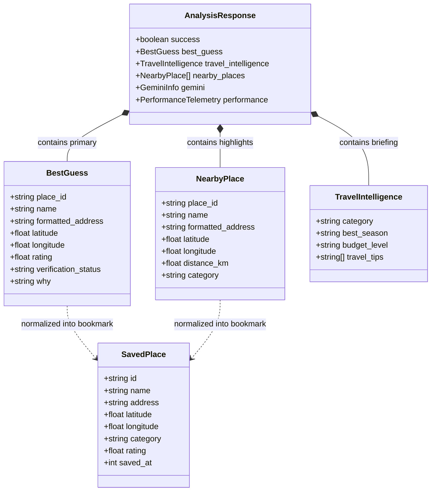
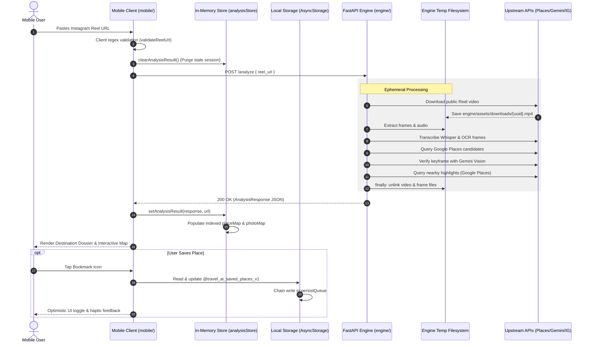

# Travel AI — Data Architecture & Data Management Guide

- **Document Role:** Authoritative Data Architecture, Storage Models, and Lifecycle Guide
- **Repository:** Travel AI (`travel-ai`)
- **Primary Surfaces:** React Native Mobile Client (`mobile/`) & FastAPI Intelligence Engine (`engine/`)
- **Status:** Canonical Operating Standard

---

## 1. Purpose & Scope

This guide provides the authoritative overview of how data is structured, ingested, transformed, transferred, cached, persisted, and cleaned up across **Travel AI**.

Travel AI operates on a **decoupled, local-first data architecture**:

```text
React Native Mobile Client (mobile/)
  • Persistent Local Storage: AsyncStorage (Offline Bookmarks)
  • In-Memory Transient State: analysisStore (Active Session)
        │
        ▼ HTTP REST JSON Contracts (POST /analyze, GET /places/photo)
FastAPI Intelligence Engine (engine/)
  • Stateless Pipeline Orchestrator (Zero Persistent Database)
  • Ephemeral Processing Filesystem: Downloads & Frame Extraction (Purged in finally blocks)
        │
        ▼ Upstream External Data Providers
External Services
  • Public Instagram Media (yt-dlp ephemeral download)
  • Google Places API (Places Search, Details, Nearby Points of Interest)
  • Google Gemini 2.5 Flash (Multimodal verification & travel briefing)
```

---

## 2. Core Architectural Reality: Database Status

> [!IMPORTANT]
> **Travel AI DOES NOT use a traditional persistent database.**
>
> There is **no** relational database (PostgreSQL, MySQL, SQLite) and **no** server-side document or key-value store (MongoDB, Redis, DynamoDB) in the production application path.
>
> * **Backend (FastAPI):** Completely **stateless**. It does not store user accounts, request histories, analysis logs, or destination records in a database.
> * **Mobile Client (React Native):** Operates on an **offline-first local persistence model** using `@react-native-async-storage/async-storage` exclusively on the user's physical device.

---

## 3. Data Storage Layers

| Storage Layer | Location | Technology | Persistence Type | Lifecycle | Data Contents |
| :--- | :--- | :--- | :--- | :--- | :--- |
| **User Bookmarks** | Mobile Client | `@react-native-async-storage/async-storage` | **Local Persistent** | Indefinite (User-controlled) | Saved destinations and POIs (`@travel_ai_saved_places_v1`) |
| **Active Session Cache** | Mobile Client | In-Memory (`analysisStore`) | **In-Memory Transient** | Active Session | Active `AnalysisResponse`, `placeMap`, `photoMap` |
| **Component UI State** | Mobile Client | React Hooks (`useState`) | **Volatile** | Screen Mount | Input text, filter selections, active map marker, sheet snap state |
| **Pipeline State** | Backend Engine | In-Memory (Python Objects) | **Volatile** | Request Duration | Extracted text, candidate ranking matrix, Gemini results |
| **Media Scratchpad** | Backend Engine | Local Filesystem (`assets/`) | **Ephemeral File** | Seconds (Purged in `finally`) | Downloaded `.mp4`, audio tracks, sampled `.jpg` keyframes |
| **Photo Media Cache** | Backend Proxy | HTTP Response Headers | **HTTP Edge Cache** | 24 Hours (`max-age=86400`) | Cached Google Places photo bytes via `/places/photo` |
| **Server Persistence** | Backend Engine | None | **None** | N/A | No user accounts, no query history, no persistent tables |

---

## 4. Core Data Entities

The application's data models are defined using **TypeScript interfaces** on the client (`mobile/types/analysis.ts`, `mobile/lib/storage/saved-places.ts`) and mirrored by **Pydantic v2 schemas** on the backend (`engine/domain/schemas/responses.py`).

### 4.1 Entity Schema Definitions

#### 1. `SavedPlace` (Client-Side Persistent Entity)
* **Storage Location:** Mobile device `AsyncStorage` under key `@travel_ai_saved_places_v1`.
* **Purpose:** Represents a bookmarked primary destination or nearby highlight stored offline.

| Field | Type | Required | Description |
| :--- | :--- | :--- | :--- |
| `id` | `string` | **Yes** | Primary key. Canonical Google `place_id` or generated `place_${timestamp}`. |
| `name` | `string` | **Yes** | Landmark or point of interest name. |
| `address` | `string` | No | Formatted human-readable street address. |
| `latitude` | `number \| null` | No | WGS84 latitude coordinate within `[-90, 90]`. |
| `longitude` | `number \| null` | No | WGS84 longitude coordinate within `[-180, 180]`. |
| `category` | `string` | No | Category classification (e.g. *"Primary Destination"*, *"Attractions"*, *"Dining"*). |
| `rating` | `number` | No | Normalized star rating clamped to `[0.0, 5.0]`. |
| `review_count` | `number` | No | Total user rating count. |
| `distance` | `number \| null` | No | Linear distance from destination in kilometers. |
| `photo` | `string` | No | Photo URL or relative photo proxy path (`/places/photo?name=...`). |
| `maps_url` | `string` | No | External Google Maps or Apple Maps web link. |
| `tags` | `string[]` | No | Normalized category tags. |
| `saved_at` | `number` | **Yes** | Unix timestamp (milliseconds) when bookmarked. |

---

#### 2. `BestGuess` (Primary Destination Candidate)
* **Storage Location:** In-memory on client (`analysisStore`) & backend response payload.
* **Purpose:** The top-ranked, verified real-world destination extracted from the Reel.

| Field | Type | Description |
| :--- | :--- | :--- |
| `place_id` | `string` | Unique Google Places identifier. |
| `name` | `string` | Verified landmark or destination name. |
| `formatted_address` | `string` | Standardized address hierarchy (street, city, country). |
| `country` / `city` / `region` | `string \| null` | Geocoded administrative divisions. |
| `latitude` / `longitude` | `number \| null` | Verified geographic coordinates. |
| `rating` / `user_ratings_total` | `number` | Google Places rating metrics. |
| `types` | `string[]` | Architectural/geographic category classification. |
| `photos` | `DestinationPhoto[]` | Visual asset metadata references. |
| `maps_url` | `string` | Direct map navigation link. |
| `confidence` | `number` | Composite confidence score (0 to 100). |
| `confidence_level` | `'VERY_HIGH' \| 'HIGH' \| 'MEDIUM' \| 'LOW'` | Human-readable confidence band. |
| `verification_status` | `'VERIFIED' \| 'PARTIAL' \| 'SKIPPED' \| 'FAILED'` | Gemini multimodal verification tier. |
| `gemini_confidence` | `number` | Gemini vision verification confidence (0.0 to 1.0). |
| `gemini_reason` | `string` | Multimodal model rationale. |
| `why` | `string` | Editorial evidence briefing explaining why this place was resolved. |

---

#### 3. `NearbyPlace` (Surrounding Point of Interest)
* **Storage Location:** In-memory on client (`analysisStore`) & backend response payload.
* **Purpose:** High-rated highlights clustered around the destination coordinates.

| Field | Type | Description |
| :--- | :--- | :--- |
| `place_id` | `string` | Unique Google Places identifier. |
| `name` | `string` | Name of the nearby venue, hotel, cafe, or attraction. |
| `formatted_address` | `string` | Local street address. |
| `latitude` / `longitude` | `number \| null` | Geographic coordinates. |
| `rating` / `user_ratings_total` | `number` | Quality metrics. |
| `types` | `string[]` | Google place types. |
| `distance_km` | `number \| null` | Proximity from primary destination in kilometers. |
| `category` | `string` | Cluster category (`Attractions`, `Dining`, `Cafes`, `Hotels`). |
| `maps_url` | `string` | Navigation URL. |

---

#### 4. `TravelIntelligence` (Editorial & Contextual Dossier)
* **Storage Location:** In-memory on client (`analysisStore`) & backend response payload.
* **Purpose:** Practical travel planning context synthesized by the intelligence engine.

| Field | Type | Description |
| :--- | :--- | :--- |
| `category` | `string` | Primary travel category (`Nature`, `Culture`, `Coastal`, `Alpine`). |
| `category_emoji` | `string` | Thematic category glyph (`🏔️`, `🏖️`, `🏛️`). |
| `best_season` | `string` | Recommended travel window (`Spring & Autumn`, `Summer`). |
| `peak_months` | `string[]` | List of peak visitation months. |
| `shoulder_months` / `avoid_months` | `string[]` | Timing guidance windows. |
| `budget_level` | `string` | Relative expense indicator (`$`, `$$`, `$$$`). |
| `estimated_daily_budget` | `string` | Approximate daily spending expectation. |
| `currency` | `string` | Local currency symbol or code. |
| `recommended_trip_days` | `string` | Suggested length of stay (e.g. `"2-3 days"`). |
| `travel_tips` | `string[]` | Practical on-the-ground tips. |
| `travel_summary` | `string` | Editorial narrative summary. |

---

#### 5. `AnalysisResponse` (Canonical Transport Contract)
* **Storage Location:** HTTP REST payload (`POST /analyze`).
* **Purpose:** Top-level transport schema encapsulating the entire analysis result.

```typescript
export interface AnalysisResponse {
  success: boolean;
  best_guess?: BestGuess | null;
  travel_intelligence?: TravelIntelligence | Record<string, unknown>;
  nearby_places?: NearbyPlace[];
  gemini?: GeminiInfo;
  stage?: string | null;
  performance?: PerformanceTelemetry | null;
  error?: string | null;
}
```

---

## 5. Entity Relationships & Data Flow



### Transformation Mapping: `BestGuess` / `NearbyPlace` → `SavedPlace`
When a user taps the bookmark icon on the mobile client, `normalizeToSavedPlace()` in `mobile/lib/storage/saved-places.ts` maps either entity into the uniform `SavedPlace` model:

```text
BestGuess / NearbyPlace                     SavedPlace
───────────────────────                     ──────────
place_id / id            ──────────────►    id
name                     ──────────────►    name
formatted_address        ──────────────►    address
latitude / longitude     ──────────────►    latitude / longitude
category                 ──────────────►    category ("Primary Destination" if BestGuess)
rating                   ──────────────►    rating (clamped to [0.0, 5.0])
user_ratings_total       ──────────────►    review_count
distance_km              ──────────────►    distance
photos[0].url            ──────────────►    photo
(System Clock)           ──────────────►    saved_at (Date.now())
```

---

## 6. End-to-End Data Lifecycle



---

## 7. Data Retrieval & Persistence Mechanics

### 7.1 Mobile In-Memory Session Cache (`analysisStore`)
Located at `mobile/lib/api/analysis-store.ts`:
* **Indexed Lookups ($O(1)$):**
  * `placeMap: Map<string, NearbyPlace>` — Indexed by `place_id`, `name`, and alias `primary_destination`.
  * `photoMap: Map<string, string>` — Indexed photo URLs for immediate card rendering.
* **Dual Resolution Strategy:**
  When `/place/[id].tsx` is inspected:
  1. Checks active in-memory session `placeMap`.
  2. If missing (e.g. app cold start), falls back to synchronous persisted read via `getSavedPlaceByIdSync(id)`.
  3. Enables bookmarked places to open fully even after closing the app or clearing active analysis state.

### 7.2 Offline Local Persistence (`savedPlaces`)
Located at `mobile/lib/storage/saved-places.ts`:
* **Storage Key:** `@travel_ai_saved_places_v1`.
* **Hydration on Boot:** `initializeSavedStorage()` parses JSON from `AsyncStorage`, validates schema properties, discards malformed entries, and populates the in-memory cache `memoryCache`.
* **Sequential Write Queue:**
  To prevent write collisions and corrupted data when a user rapidly toggles bookmarks:
  ```typescript
  let persistQueue = Promise.resolve();

  function persistCacheToStorage(): Promise<void> {
    persistQueue = persistQueue.then(async () => {
      await AsyncStorage.setItem(STORAGE_KEY, JSON.stringify(memoryCache));
    });
    return persistQueue;
  }
  ```
* **Reactive Subscriptions:** UI components consume saved data via the `useSavedPlaces()` React hook, which listens to storage events via a subscriber `Set`.

---

## 8. Data Validation, Normalization & Geospatial Rules

### 8.1 Input Sanitization
* **Instagram Reel URLs:**
  Validated by `validateReelUrl()` (`mobile/lib/utils.ts`) and `@model_validator` (`engine/app/api/analyze.py`):
  * Matches: `^https?://(?:www\.)?instagram\.com/(?:reel|reels)/([A-Za-z0-9_-]+)`
  * Prepends missing `https://` protocols automatically.
  * Rejects non-Reel URLs (photos `/p/`, stories, profiles).

### 8.2 Geospatial Coordinate Integrity
* Implemented in `isValidCoordinate()` (`mobile/lib/maps.ts`):
  * **Latitude Range:** Finite number within `[-90.0, 90.0]`.
  * **Longitude Range:** Finite number within `[-180.0, 180.0]`.
  * **Null Island Rejection:** Coordinates with `abs(lat) < 0.0001` and `abs(lng) < 0.0001` (representing default `(0, 0)` coordinates) are explicitly rejected as invalid to prevent map marker clustering off the coast of Africa.

### 8.3 Data Normalization & Clamping
* **Star Ratings:** Clamped between `0.0` and `5.0`. Non-numeric or null ratings default to `0.0`.
* **Review Counts:** Clamped to non-negative integers (`Math.floor`).
* **Distances:** Formatted defensively (`formatDistance`): `< 1.0 km` displays in meters (`"650 m"`), `≥ 1.0 km` displays in kilometers (`"2.4 km"`). Negative or non-finite values return `null`.

---

## 9. Data Retention & Privacy Considerations

1. **Zero User PII Stored:**
   * No user accounts, emails, passwords, phone numbers, or social handles are requested or persisted.
2. **Ephemeral Video & Audio Processing:**
   * Downloaded Instagram video files and audio extracts are strictly ephemeral scratchpad data. They are never backed up, indexed, or preserved.
3. **No Centralized Query Tracking:**
   * The backend does not record which URLs were analyzed or associate queries with IP addresses.
4. **Client-Owned Bookmarks:**
   * Saved places reside exclusively in the sandbox of the user's mobile device. Uninstalling the application or clearing app data completely removes all saved bookmarks.

---

## 10. Future Database Considerations (Post-MVP)

A persistent database is not required for the current single-device MVP. However, if future product phases introduce multi-device capabilities, the following architectural extensions should be considered:

| Capability | Justification | Potential Technology | Schema Concept |
| :--- | :--- | :--- | :--- |
| **Analysis Response Caching** | Eliminate redundant Google Places and Gemini API calls for popular viral Reels. | Redis / Valkey or PostgreSQL | `reel_url_hash` → cached `AnalysisResponse` (TTL: 7 days) |
| **Cloud Locker Sync** | Allow users to access saved bookmarks across iPhone, Android, and web. | PostgreSQL with Supabase / Firebase | `users` table, `saved_places` table with foreign key `user_id` |
| **Collaborative Trips** | Multi-user shared travel itineraries. | PostgreSQL + PostGIS | `trips`, `trip_places`, `trip_collaborators` |
| **Geospatial POI Cache** | Cache Google Places nearby results to reduce Places API billing costs. | PostgreSQL with PostGIS | Spatial index on `(latitude, longitude)` with radial query caching |
