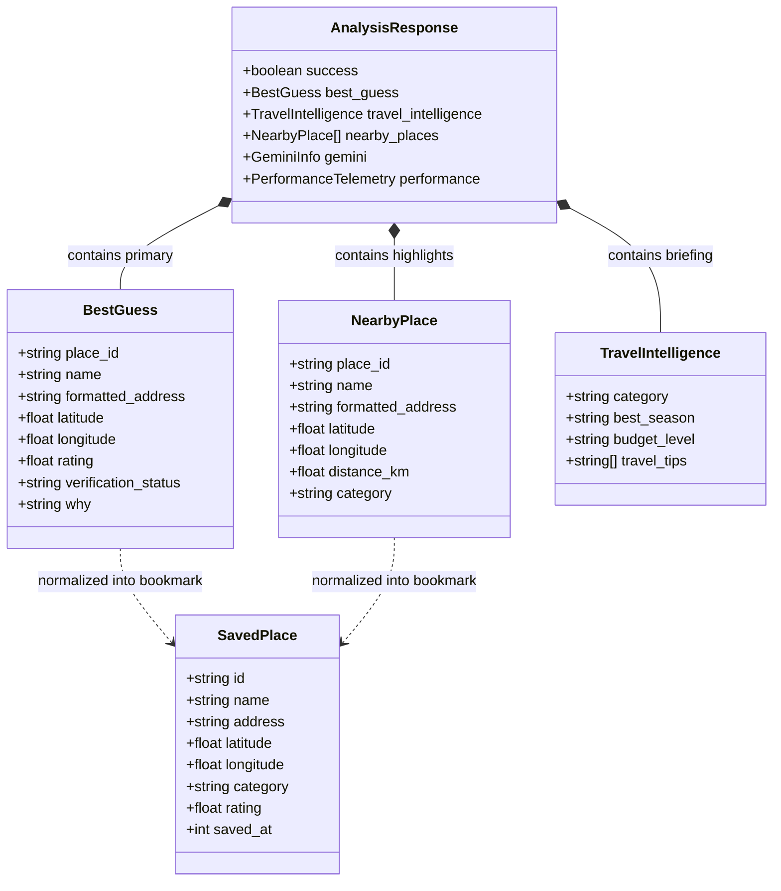
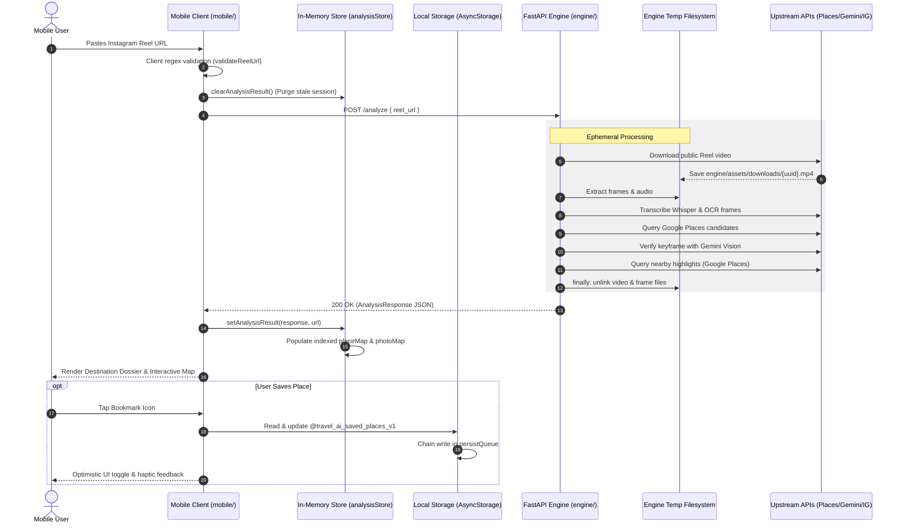

# Travel AI — Data Architecture & Data Management Guide

- **Document Role:** Authoritative Data Architecture, Storage Models, and Lifecycle Guide
- **Repository:** Travel AI (`travel-ai`)
- **Primary Surfaces:** React Native Mobile Client (`mobile/`) & FastAPI Intelligence Engine (`engine/`)
- **Status:** Canonical Operating Standard

---

## 1. Purpose & Scope

This guide provides the authoritative overview of how data is structured, ingested, transformed, transferred, cached, persisted, and cleaned up across **Travel AI**.

Travel AI operates on a **decoupled, local-first data architecture**:

```text
React Native Mobile Client (mobile/)
  • Persistent Local Storage: AsyncStorage (Offline Bookmarks)
  • In-Memory Transient State: analysisStore (Active Session)
        │
        ▼ HTTP REST JSON Contracts (POST /analyze, GET /places/photo)
FastAPI Intelligence Engine (engine/)
  • Stateless Pipeline Orchestrator (Zero Persistent Database)
  • Ephemeral Processing Filesystem: Downloads & Frame Extraction (Purged in finally blocks)
        │
        ▼ Upstream External Data Providers
External Services
  • Public Instagram Media (yt-dlp ephemeral download)
  • Google Places API (Places Search, Details, Nearby Points of Interest)
  • Google Gemini 2.5 Flash (Multimodal verification & travel briefing)
```

---

## 2. Core Architectural Reality: Database Status

> [!IMPORTANT]
> **Travel AI DOES NOT use a traditional persistent database.**
>
> There is **no** relational database (PostgreSQL, MySQL, SQLite) and **no** server-side document or key-value store (MongoDB, Redis, DynamoDB) in the production application path.
>
> * **Backend (FastAPI):** Completely **stateless**. It does not store user accounts, request histories, analysis logs, or destination records in a database.
> * **Mobile Client (React Native):** Operates on an **offline-first local persistence model** using `@react-native-async-storage/async-storage` exclusively on the user's physical device.

---

## 3. Data Storage Layers

| Storage Layer | Location | Technology | Persistence Type | Lifecycle | Data Contents |
| :--- | :--- | :--- | :--- | :--- | :--- |
| **User Bookmarks** | Mobile Client | `@react-native-async-storage/async-storage` | **Local Persistent** | Indefinite (User-controlled) | Saved destinations and POIs (`@travel_ai_saved_places_v1`) |
| **Active Session Cache** | Mobile Client | In-Memory (`analysisStore`) | **In-Memory Transient** | Active Session | Active `AnalysisResponse`, `placeMap`, `photoMap` |
| **Component UI State** | Mobile Client | React Hooks (`useState`) | **Volatile** | Screen Mount | Input text, filter selections, active map marker, sheet snap state |
| **Pipeline State** | Backend Engine | In-Memory (Python Objects) | **Volatile** | Request Duration | Extracted text, candidate ranking matrix, Gemini results |
| **Media Scratchpad** | Backend Engine | Local Filesystem (`assets/`) | **Ephemeral File** | Seconds (Purged in `finally`) | Downloaded `.mp4`, audio tracks, sampled `.jpg` keyframes |
| **Photo Media Cache** | Backend Proxy | HTTP Response Headers | **HTTP Edge Cache** | 24 Hours (`max-age=86400`) | Cached Google Places photo bytes via `/places/photo` |
| **Server Persistence** | Backend Engine | None | **None** | N/A | No user accounts, no query history, no persistent tables |

---

## 4. Core Data Entities

The application's data models are defined using **TypeScript interfaces** on the client (`mobile/types/analysis.ts`, `mobile/lib/storage/saved-places.ts`) and mirrored by **Pydantic v2 schemas** on the backend (`engine/domain/schemas/responses.py`).

### 4.1 Entity Schema Definitions

#### 1. `SavedPlace` (Client-Side Persistent Entity)
* **Storage Location:** Mobile device `AsyncStorage` under key `@travel_ai_saved_places_v1`.
* **Purpose:** Represents a bookmarked primary destination or nearby highlight stored offline.

| Field | Type | Required | Description |
| :--- | :--- | :--- | :--- |
| `id` | `string` | **Yes** | Primary key. Canonical Google `place_id` or generated `place_${timestamp}`. |
| `name` | `string` | **Yes** | Landmark or point of interest name. |
| `address` | `string` | No | Formatted human-readable street address. |
| `latitude` | `number \| null` | No | WGS84 latitude coordinate within `[-90, 90]`. |
| `longitude` | `number \| null` | No | WGS84 longitude coordinate within `[-180, 180]`. |
| `category` | `string` | No | Category classification (e.g. *"Primary Destination"*, *"Attractions"*, *"Dining"*). |
| `rating` | `number` | No | Normalized star rating clamped to `[0.0, 5.0]`. |
| `review_count` | `number` | No | Total user rating count. |
| `distance` | `number \| null` | No | Linear distance from destination in kilometers. |
| `photo` | `string` | No | Photo URL or relative photo proxy path (`/places/photo?name=...`). |
| `maps_url` | `string` | No | External Google Maps or Apple Maps web link. |
| `tags` | `string[]` | No | Normalized category tags. |
| `saved_at` | `number` | **Yes** | Unix timestamp (milliseconds) when bookmarked. |

---

#### 2. `BestGuess` (Primary Destination Candidate)
* **Storage Location:** In-memory on client (`analysisStore`) & backend response payload.
* **Purpose:** The top-ranked, verified real-world destination extracted from the Reel.

| Field | Type | Description |
| :--- | :--- | :--- |
| `place_id` | `string` | Unique Google Places identifier. |
| `name` | `string` | Verified landmark or destination name. |
| `formatted_address` | `string` | Standardized address hierarchy (street, city, country). |
| `country` / `city` / `region` | `string \| null` | Geocoded administrative divisions. |
| `latitude` / `longitude` | `number \| null` | Verified geographic coordinates. |
| `rating` / `user_ratings_total` | `number` | Google Places rating metrics. |
| `types` | `string[]` | Architectural/geographic category classification. |
| `photos` | `DestinationPhoto[]` | Visual asset metadata references. |
| `maps_url` | `string` | Direct map navigation link. |
| `confidence` | `number` | Composite confidence score (0 to 100). |
| `confidence_level` | `'VERY_HIGH' \| 'HIGH' \| 'MEDIUM' \| 'LOW'` | Human-readable confidence band. |
| `verification_status` | `'VERIFIED' \| 'PARTIAL' \| 'SKIPPED' \| 'FAILED'` | Gemini multimodal verification tier. |
| `gemini_confidence` | `number` | Gemini vision verification confidence (0.0 to 1.0). |
| `gemini_reason` | `string` | Multimodal model rationale. |
| `why` | `string` | Editorial evidence briefing explaining why this place was resolved. |

---

#### 3. `NearbyPlace` (Surrounding Point of Interest)
* **Storage Location:** In-memory on client (`analysisStore`) & backend response payload.
* **Purpose:** High-rated highlights clustered around the destination coordinates.

| Field | Type | Description |
| :--- | :--- | :--- |
| `place_id` | `string` | Unique Google Places identifier. |
| `name` | `string` | Name of the nearby venue, hotel, cafe, or attraction. |
| `formatted_address` | `string` | Local street address. |
| `latitude` / `longitude` | `number \| null` | Geographic coordinates. |
| `rating` / `user_ratings_total` | `number` | Quality metrics. |
| `types` | `string[]` | Google place types. |
| `distance_km` | `number \| null` | Proximity from primary destination in kilometers. |
| `category` | `string` | Cluster category (`Attractions`, `Dining`, `Cafes`, `Hotels`). |
| `maps_url` | `string` | Navigation URL. |

---

#### 4. `TravelIntelligence` (Editorial & Contextual Dossier)
* **Storage Location:** In-memory on client (`analysisStore`) & backend response payload.
* **Purpose:** Practical travel planning context synthesized by the intelligence engine.

| Field | Type | Description |
| :--- | :--- | :--- |
| `category` | `string` | Primary travel category (`Nature`, `Culture`, `Coastal`, `Alpine`). |
| `category_emoji` | `string` | Thematic category glyph (`🏔️`, `🏖️`, `🏛️`). |
| `best_season` | `string` | Recommended travel window (`Spring & Autumn`, `Summer`). |
| `peak_months` | `string[]` | List of peak visitation months. |
| `shoulder_months` / `avoid_months` | `string[]` | Timing guidance windows. |
| `budget_level` | `string` | Relative expense indicator (`$`, `$$`, `$$$`). |
| `estimated_daily_budget` | `string` | Approximate daily spending expectation. |
| `currency` | `string` | Local currency symbol or code. |
| `recommended_trip_days` | `string` | Suggested length of stay (e.g. `"2-3 days"`). |
| `travel_tips` | `string[]` | Practical on-the-ground tips. |
| `travel_summary` | `string` | Editorial narrative summary. |

---

#### 5. `AnalysisResponse` (Canonical Transport Contract)
* **Storage Location:** HTTP REST payload (`POST /analyze`).
* **Purpose:** Top-level transport schema encapsulating the entire analysis result.

```typescript
export interface AnalysisResponse {
  success: boolean;
  best_guess?: BestGuess | null;
  travel_intelligence?: TravelIntelligence | Record<string, unknown>;
  nearby_places?: NearbyPlace[];
  gemini?: GeminiInfo;
  stage?: string | null;
  performance?: PerformanceTelemetry | null;
  error?: string | null;
}
```

---

## 5. Entity Relationships & Data Flow



### Transformation Mapping: `BestGuess` / `NearbyPlace` → `SavedPlace`
When a user taps the bookmark icon on the mobile client, `normalizeToSavedPlace()` in `mobile/lib/storage/saved-places.ts` maps either entity into the uniform `SavedPlace` model:

```text
BestGuess / NearbyPlace                     SavedPlace
───────────────────────                     ──────────
place_id / id            ──────────────►    id
name                     ──────────────►    name
formatted_address        ──────────────►    address
latitude / longitude     ──────────────►    latitude / longitude
category                 ──────────────►    category ("Primary Destination" if BestGuess)
rating                   ──────────────►    rating (clamped to [0.0, 5.0])
user_ratings_total       ──────────────►    review_count
distance_km              ──────────────►    distance
photos[0].url            ──────────────►    photo
(System Clock)           ──────────────►    saved_at (Date.now())
```

---

## 6. End-to-End Data Lifecycle



---

## 7. Data Retrieval & Persistence Mechanics

### 7.1 Mobile In-Memory Session Cache (`analysisStore`)
Located at `mobile/lib/api/analysis-store.ts`:
* **Indexed Lookups ($O(1)$):**
  * `placeMap: Map<string, NearbyPlace>` — Indexed by `place_id`, `name`, and alias `primary_destination`.
  * `photoMap: Map<string, string>` — Indexed photo URLs for immediate card rendering.
* **Dual Resolution Strategy:**
  When `/place/[id].tsx` is inspected:
  1. Checks active in-memory session `placeMap`.
  2. If missing (e.g. app cold start), falls back to synchronous persisted read via `getSavedPlaceByIdSync(id)`.
  3. Enables bookmarked places to open fully even after closing the app or clearing active analysis state.

### 7.2 Offline Local Persistence (`savedPlaces`)
Located at `mobile/lib/storage/saved-places.ts`:
* **Storage Key:** `@travel_ai_saved_places_v1`.
* **Hydration on Boot:** `initializeSavedStorage()` parses JSON from `AsyncStorage`, validates schema properties, discards malformed entries, and populates the in-memory cache `memoryCache`.
* **Sequential Write Queue:**
  To prevent write collisions and corrupted data when a user rapidly toggles bookmarks:
  ```typescript
  let persistQueue = Promise.resolve();

  function persistCacheToStorage(): Promise<void> {
    persistQueue = persistQueue.then(async () => {
      await AsyncStorage.setItem(STORAGE_KEY, JSON.stringify(memoryCache));
    });
    return persistQueue;
  }
  ```
* **Reactive Subscriptions:** UI components consume saved data via the `useSavedPlaces()` React hook, which listens to storage events via a subscriber `Set`.

---

## 8. Data Validation, Normalization & Geospatial Rules

### 8.1 Input Sanitization
* **Instagram Reel URLs:**
  Validated by `validateReelUrl()` (`mobile/lib/utils.ts`) and `@model_validator` (`engine/app/api/analyze.py`):
  * Matches: `^https?://(?:www\.)?instagram\.com/(?:reel|reels)/([A-Za-z0-9_-]+)`
  * Prepends missing `https://` protocols automatically.
  * Rejects non-Reel URLs (photos `/p/`, stories, profiles).

### 8.2 Geospatial Coordinate Integrity
* Implemented in `isValidCoordinate()` (`mobile/lib/maps.ts`):
  * **Latitude Range:** Finite number within `[-90.0, 90.0]`.
  * **Longitude Range:** Finite number within `[-180.0, 180.0]`.
  * **Null Island Rejection:** Coordinates with `abs(lat) < 0.0001` and `abs(lng) < 0.0001` (representing default `(0, 0)` coordinates) are explicitly rejected as invalid to prevent map marker clustering off the coast of Africa.

### 8.3 Data Normalization & Clamping
* **Star Ratings:** Clamped between `0.0` and `5.0`. Non-numeric or null ratings default to `0.0`.
* **Review Counts:** Clamped to non-negative integers (`Math.floor`).
* **Distances:** Formatted defensively (`formatDistance`): `< 1.0 km` displays in meters (`"650 m"`), `≥ 1.0 km` displays in kilometers (`"2.4 km"`). Negative or non-finite values return `null`.

---

## 9. Data Retention & Privacy Considerations

1. **Zero User PII Stored:**
   * No user accounts, emails, passwords, phone numbers, or social handles are requested or persisted.
2. **Ephemeral Video & Audio Processing:**
   * Downloaded Instagram video files and audio extracts are strictly ephemeral scratchpad data. They are never backed up, indexed, or preserved.
3. **No Centralized Query Tracking:**
   * The backend does not record which URLs were analyzed or associate queries with IP addresses.
4. **Client-Owned Bookmarks:**
   * Saved places reside exclusively in the sandbox of the user's mobile device. Uninstalling the application or clearing app data completely removes all saved bookmarks.

---

## 10. Future Database Considerations (Post-MVP)

A persistent database is not required for the current single-device MVP. However, if future product phases introduce multi-device capabilities, the following architectural extensions should be considered:

| Capability | Justification | Potential Technology | Schema Concept |
| :--- | :--- | :--- | :--- |
| **Analysis Response Caching** | Eliminate redundant Google Places and Gemini API calls for popular viral Reels. | Redis / Valkey or PostgreSQL | `reel_url_hash` → cached `AnalysisResponse` (TTL: 7 days) |
| **Cloud Locker Sync** | Allow users to access saved bookmarks across iPhone, Android, and web. | PostgreSQL with Supabase / Firebase | `users` table, `saved_places` table with foreign key `user_id` |
| **Collaborative Trips** | Multi-user shared travel itineraries. | PostgreSQL + PostGIS | `trips`, `trip_places`, `trip_collaborators` |
| **Geospatial POI Cache** | Cache Google Places nearby results to reduce Places API billing costs. | PostgreSQL with PostGIS | Spatial index on `(latitude, longitude)` with radial query caching |

---

## 11. Supabase Cloud Database & Row Level Security (Stage 1 & 2)

In Travel AI V2, Supabase PostgreSQL acts as the cloud persistence layer for user profiles, analysis history, and synchronized bookmarks, maintaining complete decoupling from the stateless FastAPI intelligence engine.

### 11.1 Managed Tables & Security Model

All four cloud tables enforce **Row Level Security (RLS)**. By default, unauthenticated (`anon`) users have **zero access** (cannot select, insert, update, or delete records).

| Table | Stage | RLS Status | Permitted Roles | Access Scope & Constraints |
| :--- | :--- | :--- | :--- | :--- |
| `profiles` | 1 & 2 | **ENABLED** | `authenticated` | SELECT, INSERT, UPDATE, DELETE for own profile (`auth.uid() = id`). `WITH CHECK (auth.uid() = id)` enforces identity immutability. |
| `analyses` | 1 & 2 | **ENABLED** | `authenticated` | SELECT, INSERT, UPDATE, DELETE for own analyses (`user_id = auth.uid()`). `WITH CHECK` prevents reassigning records. |
| `analysis_places` | 1 & 2 | **ENABLED** | `authenticated` | SELECT, INSERT, UPDATE, DELETE only when parent `analyses.user_id = auth.uid()`. `WITH CHECK` prevents linking POIs to other users' analyses. |
| `saved_places` | 1 & 2 | **ENABLED** | `authenticated` | SELECT, INSERT, UPDATE, DELETE for own bookmarks (`user_id = auth.uid()`). Unique constraint on `(user_id, place_id)`. |

### 11.2 Applied Policies Matrix

1. **`profiles`:**
   - `profiles_select_own`: `FOR SELECT TO authenticated USING (auth.uid() = id)`
   - `profiles_insert_own`: `FOR INSERT TO authenticated WITH CHECK (auth.uid() = id)`
   - `profiles_update_own`: `FOR UPDATE TO authenticated USING (auth.uid() = id) WITH CHECK (auth.uid() = id)`
   - `profiles_delete_own`: `FOR DELETE TO authenticated USING (auth.uid() = id)`

2. **`analyses`:**
   - `analyses_select_own`: `FOR SELECT TO authenticated USING (auth.uid() = user_id)`
   - `analyses_insert_own`: `FOR INSERT TO authenticated WITH CHECK (auth.uid() = user_id)`
   - `analyses_update_own`: `FOR UPDATE TO authenticated USING (auth.uid() = user_id) WITH CHECK (auth.uid() = user_id)`
   - `analyses_delete_own`: `FOR DELETE TO authenticated USING (auth.uid() = user_id)`

3. **`analysis_places`:**
   - `analysis_places_select_own`: `FOR SELECT TO authenticated USING (EXISTS (SELECT 1 FROM public.analyses WHERE analyses.id = analysis_places.analysis_id AND analyses.user_id = auth.uid()))`
   - `analysis_places_insert_own`: `FOR INSERT TO authenticated WITH CHECK (EXISTS (SELECT 1 FROM public.analyses WHERE analyses.id = analysis_places.analysis_id AND analyses.user_id = auth.uid()))`
   - `analysis_places_update_own`: `FOR UPDATE TO authenticated USING (...) WITH CHECK (...)`
   - `analysis_places_delete_own`: `FOR DELETE TO authenticated USING (...)`

4. **`saved_places`:**
   - `saved_places_select_own`: `FOR SELECT TO authenticated USING (auth.uid() = user_id)`
   - `saved_places_insert_own`: `FOR INSERT TO authenticated WITH CHECK (auth.uid() = user_id)`
   - `saved_places_update_own`: `FOR UPDATE TO authenticated USING (auth.uid() = user_id) WITH CHECK (auth.uid() = user_id)`
   - `saved_places_delete_own`: `FOR DELETE TO authenticated USING (auth.uid() = user_id)`

---

### 11.3 How to Apply the Migration

#### Option A: Supabase Dashboard SQL Editor (Quickest)
1. Log in to [Supabase Dashboard](https://supabase.com/dashboard) and open your project.
2. In the left navigation menu, click **SQL Editor**.
3. Click **New query**.
4. Copy and paste the contents of `supabase/migrations/20261002000000_supabase_rls_security.sql` (or the complete `supabase/schema.sql` if initializing from scratch).
5. Click **Run** (or press `Ctrl+Enter` / `Cmd+Enter`).
6. Ensure the result message shows `Success. No rows returned`.

#### Option B: Supabase CLI
```bash
# Push migrations to your linked Supabase remote project
supabase db push
```

---

### 11.4 How to Verify Policies in the Supabase Dashboard

1. **Verify Table RLS Status:**
   - Open **Authentication** -> **Policies** in the left sidebar (or navigate to **Database** -> **Tables**).
   - Verify that all four tables display **RLS enabled** (green shield/badge):
     - `public.profiles`
     - `public.analyses`
     - `public.analysis_places`
     - `public.saved_places`

2. **Verify Active Policies:**
   - Expand each table under **Authentication** -> **Policies**.
   - Check that all four operations (SELECT, INSERT, UPDATE, DELETE) are listed with target role `authenticated`.
   - Confirm that no public or unauthenticated policies exist.

3. **Verify via SQL Editor Sandbox:**
   Run the following query in the **SQL Editor** to inspect policy metadata in PostgreSQL:
   ```sql
   SELECT schemaname, tablename, policyname, permissive, roles, cmd, qual, with_check
   FROM pg_policies
   WHERE schemaname = 'public'
   ORDER BY tablename, cmd;
   ```

4. **Test Anonymous Access Denial:**
   Run this simulation in the SQL Editor to prove anonymous access is blocked:
   ```sql
   SET ROLE anon;
   SELECT * FROM public.profiles;        -- Returns 0 rows
   SELECT * FROM public.analyses;        -- Returns 0 rows
   SELECT * FROM public.analysis_places; -- Returns 0 rows
   SELECT * FROM public.saved_places;    -- Returns 0 rows
   RESET ROLE;
   ```

---

## 12. Supabase Google OAuth Configuration & Mobile Integration (Stage 3)

Travel AI V2 supports seamless Google sign-in using Supabase Auth. The architecture maintains a zero-credential footprint in the mobile client: the Google Client Secret is held strictly within the Supabase backend.

```text
React Native Mobile App (Travel AI)
      │
      │ 1. signInWithOAuth('google') -> Returns auth URL
      ▼
Supabase Auth (https://<project-id>.supabase.co)
      │
      │ 2. Redirect to Google Consent
      ▼
Google Accounts (accounts.google.com)
      │
      │ 3. User approves -> Callback to Supabase
      ▼
Supabase Auth Handler (https://<project-id>.supabase.co/auth/v1/callback)
      │
      │ 4. Exchanges code with Google -> Generates session
      ▼
Deep Link Return (travelai://auth/callback#access_token=... or ?code=...)
      │
      │ 5. Intercepted by WebBrowser.openAuthSessionAsync
      ▼
Mobile App (Session stored in AsyncStorage, RLS enabled for private data)
```

### 12.1 Google Cloud Console Configuration (Manual)

1. Open the [Google Cloud Console](https://console.cloud.google.com/) and select or create your project.
2. Navigate to **APIs & Services** -> **Credentials**.
3. Configure the **OAuth Consent Screen** (if not already done):
   - User Type: **External**
   - App name: **Travel AI**
   - User support email & developer contact email: your email
   - Scopes: `openid`, `email`, `profile`
4. Click **Create Credentials** -> **OAuth client ID**:
   - Application type: **Web application** (Note: Web application type is required by Supabase Auth server).
   - Name: `Travel AI Supabase Auth`
   - **Authorized JavaScript origins:**
     - `https://<your-supabase-project-id>.supabase.co`
   - **Authorized redirect URIs:**
     - `https://<your-supabase-project-id>.supabase.co/auth/v1/callback`
5. Click **Create**. Copy the generated **Client ID** and **Client Secret**.

---

### 12.2 Supabase Dashboard Configuration (Manual)

1. In the [Supabase Dashboard](https://supabase.com/dashboard), open your Travel AI project.
2. In the left navigation, click **Authentication** -> **Providers**.
3. Locate **Google** in the provider list and toggle it **Enabled**:
   - **Client ID:** Paste the Client ID from Google Cloud Console.
   - **Client Secret:** Paste the Client Secret from Google Cloud Console.
   - Click **Save**.
4. In the left navigation, click **Authentication** -> **URL Configuration**:
   - **Site URL:** `travelai://` (or your production website URL)
   - Under **Redirect URLs**, click **Add URL** and add the following allowed callback patterns:
     - `travelai://auth/callback` (Primary production & development build deep link)
     - `travelai://*` (Wildcard scheme fallback)
     - `exp://*` (For Expo Go development on local network)
     - `http://localhost:8081/--/auth/callback` (For local simulator or web testing)
   - Click **Save**.

---

### 12.3 Real-Device Testing & Verification Procedure

1. **Verify Environment Variables:**
   Confirm `mobile/.env.local` has:
   ```env
   EXPO_PUBLIC_SUPABASE_URL=https://<your-supabase-project-id>.supabase.co
   EXPO_PUBLIC_SUPABASE_PUBLISHABLE_KEY=<your-anon-or-publishable-key>
   ```

2. **Launch the App:**
   ```bash
   cd mobile
   npx expo start
   ```

3. **Execute Guest Validation:**
   - Launch the app in guest mode.
   - Navigate to the **Analyze** tab, paste a public Instagram Reel, and verify the analysis pipeline executes fully without signing in.
   - Verify guest access to **Explore** and local **Saved** places.

4. **Execute Sign-In Flow:**
   - Navigate to **Profile** tab -> Click **Sign in with Google** (or open the **Account** modal).
   - Verify the system in-app browser opens the Google accounts selection/consent screen.
   - Complete Google sign-in.
   - Verify the browser closes automatically and redirects back to Travel AI.
   - Confirm the **Profile** screen updates immediately to show your Google account name, email, and authenticated status.

5. **Execute Session Restoration Test:**
   - Force close the mobile app completely.
   - Reopen the app.
   - Navigate to **Profile** tab and verify the user session is immediately restored without re-prompting.

6. **Execute Sign-Out Flow:**
   - Click **Sign Out** on the Profile screen.
   - Verify the screen reverts to "Guest Traveler" and stored credentials are fully cleared.

---

## 13. Supabase Sign in with Apple Configuration & Native Integration (Stage 4)

Travel AI V2 provides unified multi-provider authentication supporting both **Sign in with Apple** and **Sign in with Google** through Supabase Auth. Apple sign-in resolves to the identical Supabase user session model, enforcing the same PostgreSQL Row Level Security (RLS) policies.

```text
React Native Mobile App (Travel AI)
      │
      │ 1. signInWithApple() -> Requests authorization URL
      ▼
Supabase Auth (https://<project-id>.supabase.co)
      │
      │ 2. Redirects to Apple ID Authorization
      ▼
Apple ID Services (appleid.apple.com)
      │
      │ 3. User authorizes with Apple ID -> POST callback to Supabase
      ▼
Supabase Auth Handler (https://<project-id>.supabase.co/auth/v1/callback)
      │
      │ 4. Verifies Apple client secret JWT & creates session
      ▼
Deep Link Return (travelai://auth/callback#access_token=... or ?code=...)
      │
      │ 5. Intercepted by WebBrowser.openAuthSessionAsync
      ▼
Mobile App (Session persisted to AsyncStorage; full RLS access enabled)
```

### 13.1 Apple Developer Portal Configuration (Manual)

To enable Apple sign-in for production and staging environments, complete the following setup in the [Apple Developer Member Center](https://developer.apple.com/account):

1. **Verify App ID:**
   - Go to **Certificates, Identifiers & Profiles** -> **Identifiers** -> **App IDs**.
   - Select your app identifier: `com.travelai.mobile`.
   - Ensure the **Sign in with Apple** capability checkbox is enabled.
   - Click **Save**.

2. **Register a Services ID (For OAuth Web Flow):**
   - Click **+** next to Identifiers -> Select **Services IDs** -> Click **Continue**.
   - Description: `Travel AI Apple Auth`
   - Identifier: `com.travelai.mobile.auth` (or similar reversed-domain string).
   - Enable **Sign in with Apple** -> Click **Configure**:
     - **Primary App ID:** Select `com.travelai.mobile`.
     - **Domains and Subdomains:** Add your Supabase project domain:
       `<your-supabase-project-id>.supabase.co`
     - **Return URLs:** Add the Supabase callback endpoint:
       `https://<your-supabase-project-id>.supabase.co/auth/v1/callback`
   - Click **Done** -> **Continue** -> **Register**.

3. **Generate a Private Key:**
   - Go to **Keys** -> Click **+** to register a new key.
   - Key Name: `Travel AI Supabase Auth Key`
   - Enable **Sign in with Apple** -> Click **Configure** and choose Primary App ID `com.travelai.mobile`.
   - Click **Save** -> **Continue** -> **Register**.
   - Download the `.p8` private key file (Note: Apple allows downloading this file only once).
   - Note your **Key ID** and your Apple **Team ID** (located at the top right of the developer portal).

---

### 13.2 Supabase Dashboard Provider Configuration (Manual)

1. Open your project in the [Supabase Dashboard](https://supabase.com/dashboard).
2. Navigate to **Authentication** -> **Providers** -> **Apple**.
3. Toggle **Enable Sign in with Apple** to **ON**:
   - **Services ID (Client ID):** Enter the Services ID (e.g. `com.travelai.mobile.auth`).
   - **Apple Team ID:** Enter your 10-character Team ID.
   - **Key ID:** Enter the 10-character Key ID from the private key.
   - **Secret Key (Private Key):** Paste the contents of your downloaded `.p8` file.
4. Click **Save**.

---

### 13.3 Native Build & Platform Considerations

| Environment | Apple Sign-In Support | Requirements / Limitations |
| :--- | :--- | :--- |
| **Expo Go / Simulator** | Supported via Web OAuth | Opens Apple ID web sheet in `WebBrowser.openAuthSessionAsync`. Requires valid Supabase Apple provider config. |
| **Physical iOS Device** | Supported via Web OAuth / Native Sheet | Biometric Face ID / Touch ID supported in system sheet. |
| **Android & Web** | Supported via Web OAuth | Apple ID web authorization supported across all platforms. |
| **Production EAS Build** | Full Native & Web Support | Requires paid Apple Developer account ($99/year), provisioned distribution profile, and `com.travelai.mobile` bundle ID. |

> [!IMPORTANT]
> **Native Entitlement Note for EAS / Bare Builds:**
> If upgrading from WebBrowser OAuth to native iOS sheet authentication (`expo-apple-authentication`), the following entitlement must be added to `ios.entitlements` in `app.json`:
> ```json
> "ios": {
>   "entitlements": {
>     "com.apple.developer.applesignin": ["Default"]
>   }
> }
> ```
> This entitlement requires a paid Apple Developer account and an App ID provisioned with Sign in with Apple capability. The current WebBrowser OAuth implementation does not require native build re-linking and works immediately across platforms.

---

### 13.4 Real-Device Verification Checklist

1. **Verify Supabase Configuration:** Ensure Apple provider is enabled in Supabase Dashboard with Services ID, Team ID, Key ID, and Private Key.
2. **Start Dev Server:** `npx expo start` in `mobile/`.
3. **Guest Flow Verification:** Confirm Reel analysis works 100% without signing in.
4. **Apple Sign-In Trigger:**
   - Tap **Sign in with Apple** in the Login modal or Profile tab.
   - Verify the system authentication session prompts for Apple ID credentials / Face ID.
   - Complete authorization.
   - Confirm browser closes and redirects to `travelai://auth/callback`.
   - Confirm Profile screen shows Apple authenticated badge and user email.
5. **Multi-Provider Verification:** Confirm signing out and signing in with Google works interchangeably without session corruption.

---

## 14. Cloud Analysis History Persistence Architecture (Stage 5)

Travel AI Stage 5 implements automatic cloud persistence for successful Reel analyses when a verified Supabase authentication session exists, while preserving 100% unrestricted local analysis for guests with zero cloud writes.

```text
React Native Mobile App (Travel AI)
      │
      │ 1. Reel analysis completes on FastAPI Engine
      ▼
ProcessingScreen / History Service (mobile/lib/supabase/history.ts)
      │
      │ 2. Check supabase.auth.getSession()
      ├───────────────────────┬──────────────────────────┐
      ▼                       ▼                          ▼
Guest Mode (No Session)  Unconfigured            Authenticated Session
  • Cloud write skipped    • Write skipped         • Verified user_id = auth.uid()
  • Zero DB queries        • Local fallback        • 1. INSERT public.analyses
  • Reel results rendered  • Reel results rendered • 2. INSERT public.analysis_places
                                                   • Results rendered (non-blocking)
```

### 14.1 Persistence Model & Data Contracts

When an authenticated user analyzes a Reel, the client maps the structured `AnalysisResponse` into two relational tables in Supabase:

#### 1. Parent Analysis Record (`public.analyses`)

| Column Name | Database Type | Source Field | Description / Constraints |
| :--- | :--- | :--- | :--- |
| `id` | `UUID` | Generated | Primary key generated via `gen_random_uuid()`. |
| `user_id` | `UUID` | `session.user.id` | Verified Supabase authenticated user ID. Never client-supplied. |
| `reel_url` | `TEXT` | `targetUrl` | Normalized Instagram Reel URL. |
| `reel_id` | `TEXT` | Extracted regex | Instagram shortcode (e.g. `C8xyzExample1` from `/reel/C8xyzExample1/`). |
| `thumbnail_url` | `TEXT` | `best_guess.photos[0]` | Resolved photo URL or relative proxy path. |
| `destination` | `TEXT` | `best_guess.name` | Resolved landmark, city, or destination name. |
| `country` | `TEXT` | `best_guess.country` | Geocoded country division or `null`. |
| `confidence` | `INTEGER` | `best_guess.confidence` | Clamped integer score `[0, 100]` satisfying `CHECK` constraint. |
| `travel_intelligence` | `JSONB` | `response.travel_intelligence` | Structured travel dossier (category, seasonality, budget, tips). |
| `created_at` | `TIMESTAMPTZ` | Generated | UTC creation timestamp (defaults to `now()`). |

#### 2. Associated Discovered Places (`public.analysis_places`)

| Column Name | Database Type | Source Field | Description / Constraints |
| :--- | :--- | :--- | :--- |
| `id` | `UUID` | Generated | Primary key generated via `gen_random_uuid()`. |
| `analysis_id` | `UUID` | Parent `analyses.id` | Foreign key referencing parent analysis with `ON DELETE CASCADE`. |
| `place_id` | `TEXT` | `place.place_id` | Canonical Google Places ID or generated identifier. Deduplicated. |
| `name` | `TEXT` | `place.name` | Verified place or venue name. |
| `address` | `TEXT` | `place.formatted_address` | Local street address hierarchy. |
| `latitude` | `DOUBLE PRECISION` | `place.latitude` | WGS84 coordinate within `[-90, 90]`. |
| `longitude` | `DOUBLE PRECISION` | `place.longitude` | WGS84 coordinate within `[-180, 180]`. |
| `rating` | `NUMERIC(3, 2)` | `place.rating` | Clamped rating `[0.00, 5.00]` rounded to 2 decimal places. |
| `category` | `TEXT` | `place.category` | Classification tag (`Primary Destination`, `Attractions`, `Dining`). |
| `photo_url` | `TEXT` | `place.photos[0]` | Resolved photo URL or proxy path. |
| `created_at` | `TIMESTAMPTZ` | Generated | UTC creation timestamp (defaults to `now()`). |

---

### 14.2 Strict Ephemeral Media Boundary

> [!IMPORTANT]
> **Zero Raw Media Storage:**
> - Under no circumstances are video files (`.mp4`), audio tracks (`.m4a`), extracted video keyframes (`.jpg`), or raw speech transcripts persisted in Supabase tables or Supabase Storage.
> - Only verified destination metadata, coordinates, confidence scores, and structured JSON dossiers are persisted.
> - All media processing remains 100% ephemeral on the FastAPI engine and is purged immediately upon completion.

---

### 14.3 Guest vs. Authenticated Behavior

- **Authenticated Users:** Successful analyses automatically trigger background persistence via `saveAnalysisToCloudHistory(response, reelUrl)`.
- **Guest Users:** If `supabase.auth.getSession()` returns no active session (`session == null`), `saveAnalysisToCloudHistory` immediately exits with `{ status: 'skipped_guest' }`. **Zero SQL queries or network calls are made to Supabase.**
- **Preserved User Experience:** Cloud persistence is completely non-blocking. If persistence encounters an error or network drop, the analysis view transitions to the Results screen normally without any disruptive error dialogs or artificial failure states.

---

### 14.4 Parent-Child RLS Compliance & Atomic Cleanup

1. **Parent-First Insertion Order:**
   - The client always inserts into `public.analyses` first with `user_id = auth.uid()`.
   - The RLS policy `analyses_insert_own` (`WITH CHECK (auth.uid() = user_id)`) validates and commits the row.
2. **Child Insertion Order:**
   - The child records in `public.analysis_places` are inserted second, referencing the committed parent `analysis_id`.
   - The RLS policy `analysis_places_insert_own` (`WITH CHECK (EXISTS (SELECT 1 FROM public.analyses WHERE analyses.id = analysis_places.analysis_id AND analyses.user_id = auth.uid()))`) validates that the parent record belongs to the requesting user.
3. **Partial Failure Cleanup:**
   - If child place insertion fails after the parent analysis has been saved, the service immediately initiates safe cleanup:
     ```ts
     await activeClient.from('analyses').delete().eq('id', analysisId);
     ```
   - Because of `ON DELETE CASCADE`, deleting the parent analysis automatically purges any partially inserted child places, preventing orphan or corrupted history records.
   - The service returns `{ status: 'error', partialPlacesFailed: true }` without throwing.

---

### 14.5 Accidental Duplicate Prevention

To guard against duplicate database records caused by rapid component re-renders or repeated callbacks:
1. **Response Object Tracking:** A `WeakSet<AnalysisResponse>` caches persisted response instances in memory.
2. **Execution Cooldown Window:** A 10-second debounce cache keyed by `${userId}:${normalizedUrl}` coalesces rapid repeated calls for the identical analysis session.
3. **In-Flight Coalescing:** Concurrent simultaneous calls for the same URL share the same active promise.
4. **Intentional Re-Analysis Permitted:** If a user intentionally runs an analysis again after the 10-second window, the separate analysis is persisted normally.

---

### 14.6 History Screen Data Layer (Preparedness)

`mobile/lib/supabase/history.ts` exports the following typed query and mutation methods for the future History screen:

```ts
// Fetch paginated analysis history for the signed-in user
export async function getUserAnalyses(
  options?: { limit?: number; offset?: number },
  client?: SupabaseClient<Database>
): Promise<{ data: AnalysisRow[] | null; error: string | null }>;

// Fetch a single analysis record with all associated places
export async function getAnalysisDetail(
  analysisId: string,
  client?: SupabaseClient<Database>
): Promise<{ data: AnalysisDetail | null; error: string | null }>;

// Delete an analysis record (cascades to all child places)
export async function deleteAnalysis(
  analysisId: string,
  client?: SupabaseClient<Database>
): Promise<{ success: boolean; error: string | null }>;
```

---

### 14.7 Live & Local Verification Checklist

1. **Run TypeScript Check:**
   ```powershell
   npx --prefix mobile tsc --noEmit
   ```
2. **Run Git Check:**
   ```powershell
   git diff --check
   ```
3. **Run Boundary Test Suite:**
   ```powershell
   npx tsx mobile/lib/supabase/__tests__/run-tests.ts
   ```
4. **Run Backend Schema Tests:**
   ```powershell
   python -m unittest engine/tests/test_v2_supabase_schema.py
   ```
5. **Live Supabase Verification (Optional with Live Credentials):**
   - Configure valid `EXPO_PUBLIC_SUPABASE_URL` and `EXPO_PUBLIC_SUPABASE_PUBLISHABLE_KEY` in `mobile/.env.local`.
   - Sign in via Google or Apple OAuth on mobile.
   - Analyze a public Instagram Reel (e.g. `https://www.instagram.com/reel/C8xyzExample1/`).
   - Open Supabase Table Editor -> inspect `analyses` table -> confirm row created with `user_id = <auth.uid()>`.
   - Inspect `analysis_places` table -> confirm child places created referencing `analysis_id`.
   - Sign out -> analyze another Reel as guest -> confirm no new rows created in `analyses`.

---

## 15. Stage 6 — History and Saved Places User Experience & Cloud Contracts

Stage 6 completes the user-facing History and Saved Places experience for the Travel AI mobile app, building directly upon the persistence and authentication layers from Stages 1–5.

### 15.1 Cloud Saved Places CRUD & Duplicate Prevention

- **Database Table:** `public.saved_places`
- **Schema Constraints:** Unique constraint `saved_places_user_place_unique (user_id, place_id)` ensures a user cannot accidentally create duplicate bookmarks for the same place.
- **Repository Operations (`mobile/lib/supabase/saved-places.ts`):**
  - `getCloudSavedPlaces()`: Retrieves all bookmarked places for the authenticated user, ordered by `created_at DESC`.
  - `saveCloudPlace(place, photoUrl)`: Inserts or updates the bookmark using `upsert` with `onConflict: 'user_id,place_id'`.
  - `removeCloudPlace(placeId)`: Deletes the bookmark row where `place_id = :placeId` and `user_id = auth.uid()`.
- **Offline / Sync Harmony:** `useSavedPlaces` syncs cloud data to local memory and `AsyncStorage` on authentication events and provides pull-to-refresh on the Saved tab.

### 15.2 Guest In-Memory Retention & Authentication Resumption

1. **Guest Save Trigger:**
   - When a guest taps Save on a place or analysis result, zero writes are made to Supabase.
   - The action is captured in memory via `setPendingSaveAction(place, photoUrl)`.
   - The app navigates to the OAuth modal (`/(auth)/login`).
2. **Successful Authentication Resumption:**
   - When Google or Apple sign-in completes successfully, `executePendingSaveAction()` retrieves the pending item from memory and executes `saveCloudPlace`.
   - The saved place is immediately synced into local cache (`syncCloudPlaceToCache`).
   - The app returns to the active screen (`router.back()`).
   - **Crucial Rule:** The Instagram Reel analysis is **NOT** rerun. The existing in-memory result is preserved seamlessly.
3. **Cancellation & Failure Safety:**
   - If the user dismisses the sign-in modal or cancels the OAuth flow, `clearPendingSaveAction()` immediately purges the pending action from memory.
   - The current view is preserved; the item is **not** claimed as saved.

### 15.3 Analysis History Experience

- **Navigation Entry:** Accessible directly from the Profile tab (`mobile/app/(tabs)/profile.tsx`) under `TRAVEL INTELLIGENCE`.
- **No Bottom Tab Changes:** Retains the exact 4-tab bar layout: `Analyze`, `Explore`, `Saved`, `Profile`.
- **History List (`mobile/app/history/index.tsx`):**
  - Uses `getUserAnalyses({ limit: 50 })`.
  - Displays destination name, country, thumbnail photo, confidence status badge, and creation date.
  - Supports pull-to-refresh and individual analysis deletion with cascading cleanup.
- **History Detail Dossier (`mobile/app/history/[id].tsx`):**
  - Uses `getAnalysisDetail(id)` to retrieve parent analysis and associated places.
  - Displays travel intelligence: overview, seasonality, vibe, budget, customs, and field tips.
  - Displays discovered points of interest using `PlaceCard` with direct external map routing and bookmarking.
  - Safely handles unavailable or incomplete fields with graceful fallbacks.
